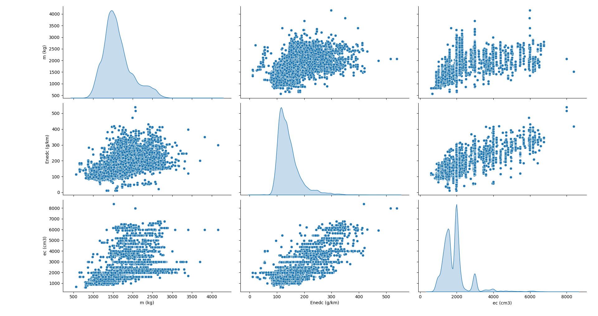
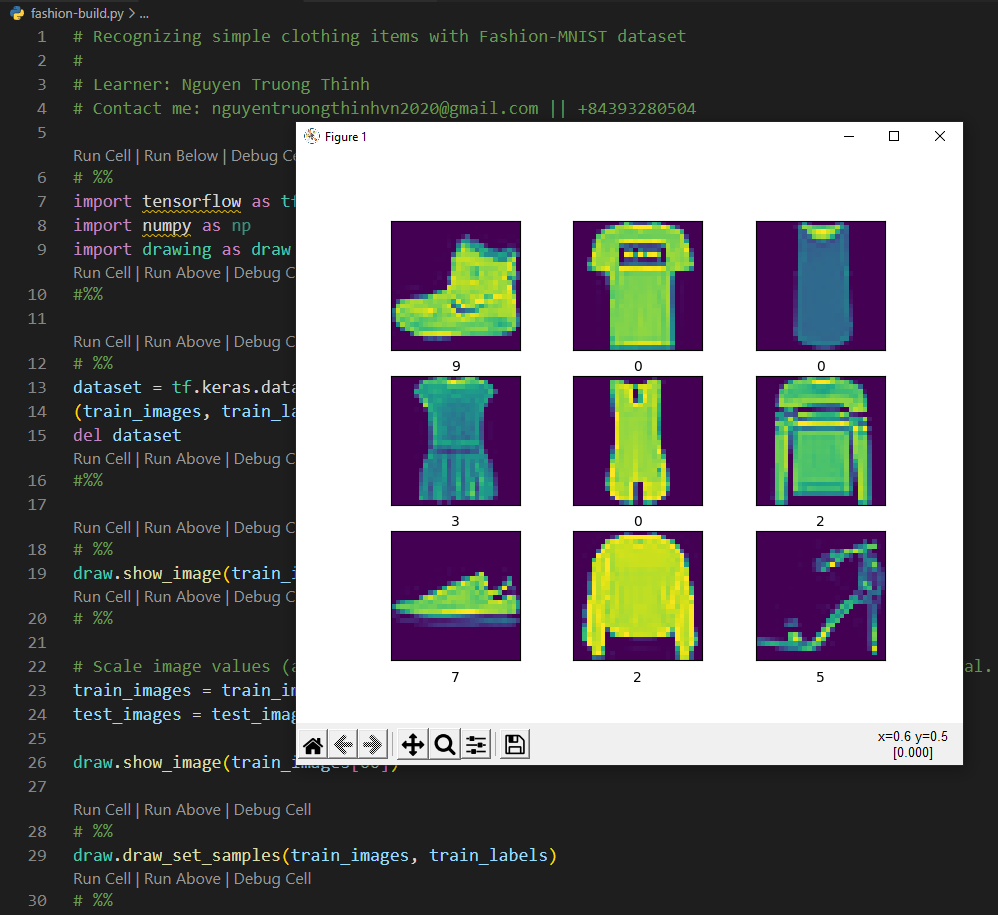
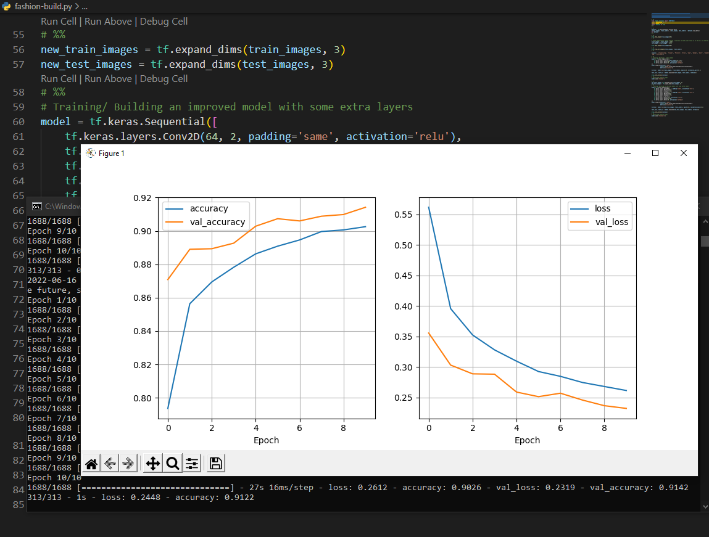
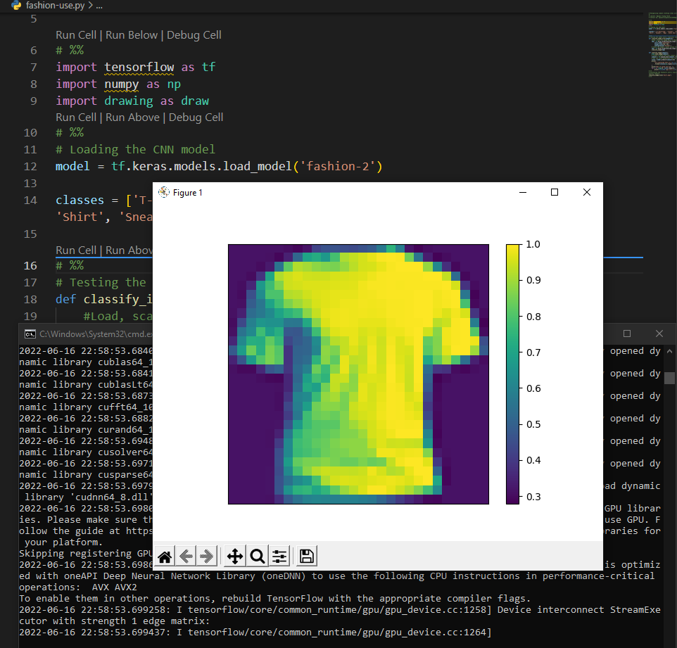
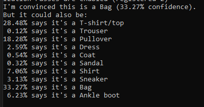

<strong><em>Thanks for your reading, please give me a STAR!<em><strong>
#### Introduction
"Trainging Classification Models for Image Recognition with TensorFlow toward Clothing" 
<strong>This is a learning material from software developer Vasco Correia Veloso<strong> 

___
#### #1: Visualizing the CO2 emissions training dataset
 
  

#### #2: Some images taken from the Fashion-MNIST dataset
 
  

#### #3: Training results (a Convolutional Neural Network-CNN) of the MNIST network on the Fashion-MINIST dataset
 
  

#### #4: The realistic clothing image used to try the Fashion-MNIST models
 
 
 

### Used Software Info:
- Python 3.7.9
- Pipenv (Pip)
- TensorFlow 2 (2.5.1)
- pandas, matplotlib, numpy, seaborn, base64hex
- Visual Studio Code v1.67.1

### References
- TensorFlow: https://www.tensorflow.org/
- Pandas: https://pandas.pydata.org/
- Matplotlib: https://matplotlib.org/
- Numpy: https://numpy.org/
- Seaborn: https://seaborn.pydata.org/
